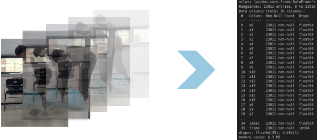
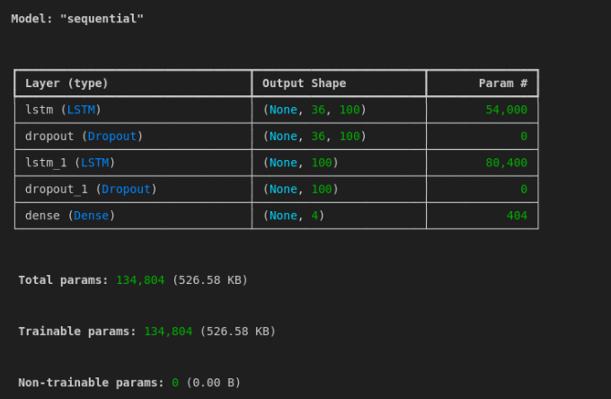
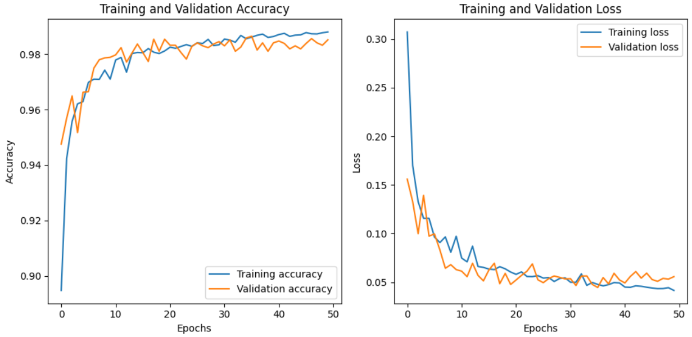
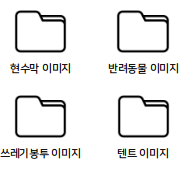
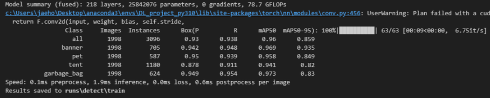
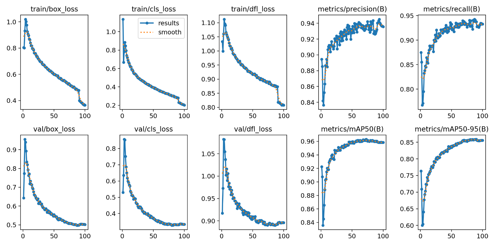

# 행위와 객체 인식 기반 단지 내 시설물 관리 보조 시스템

## 1.프로젝트 개요

### 1.1 주제 소개

### 1.2 기술 스택
|||
|:---|:---|
|개발 환경|  |
|언어| |
|딥러닝 및 영상처리| |
|GUI|
|데이터베이스| |
|서버||
|협업|   |

### 1.3 팀원 소개
|이름|직책|담당|
|:---|:---|:---|
|강지연|팀장|GUI - CCTV Page 구현, GIT 관리|
|조성현|팀원|GUI - LOG Page 구현, 웹서버 구축|
|김요한|팀원|Action v1, Object v0, Process 구현|
|신재훈|팀원|Action v0, Object v1 구현, 발표|
|조성오|팀원|데이터 라벨링, 시나리오 구성, 협업 툴 관리|

### 1.4 시연 영상

## 2. 프로젝트 설계

### 2.1 소프트웨어 요구사항

### 2.2 시스템구성도

## 3. 모델 설계

### 3.1 시행착오
|모델|방식|교훈|
|:---|:---|:---|
|action v0|mediapipe, LSTM|데이터 선정 및 전처리 중요성|
|object v0|labelme, YOLO-detect|모델 성능 개선 필요|
|object v0.1|YOLO-pose와 YOLO-detect|action 모델 필요|

## 3.2 최종 모델

### Action v1
#### 데이터 전처리

#### 모델 학습

#### 모델 평가

### Object v1

#### 데이터 전처리

#### 모델 학습

#### 모델 평가

